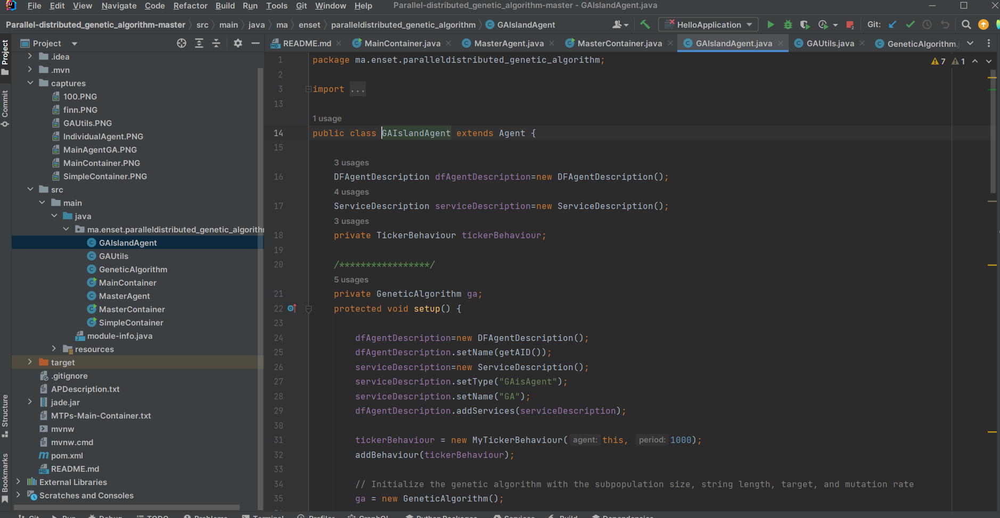
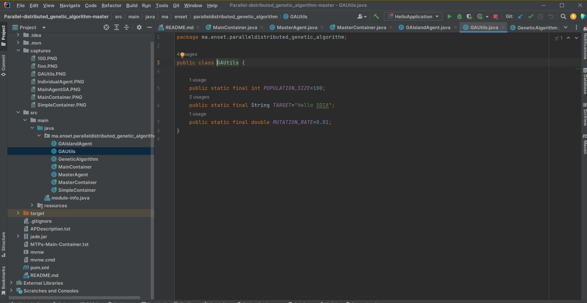
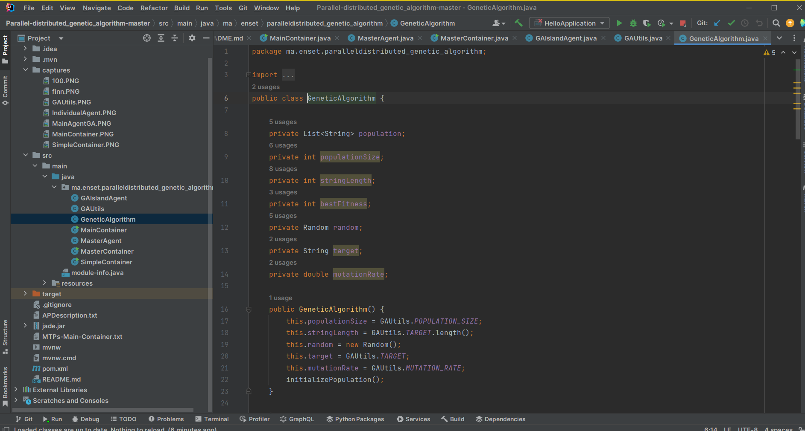
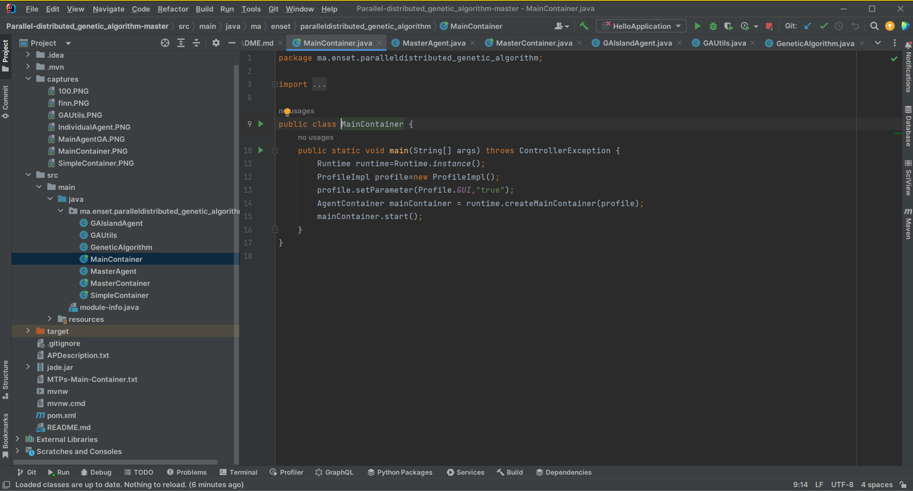
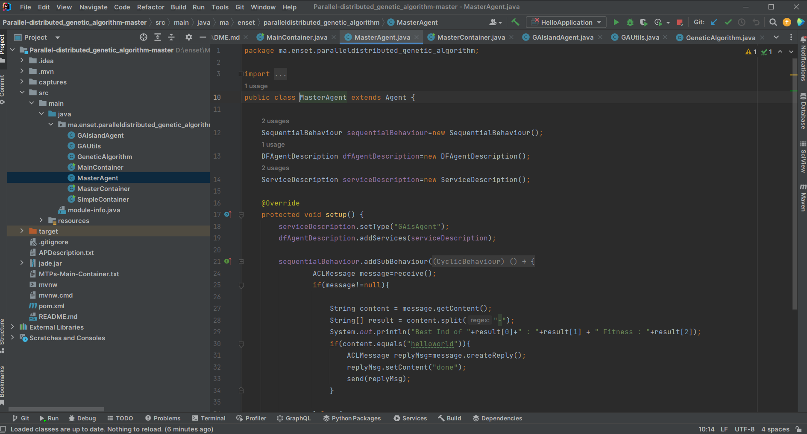
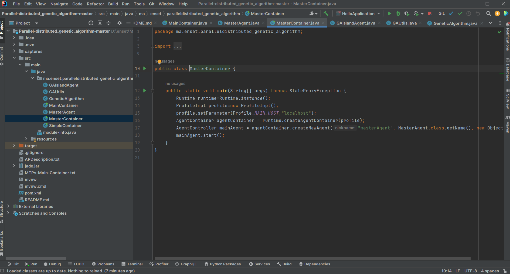
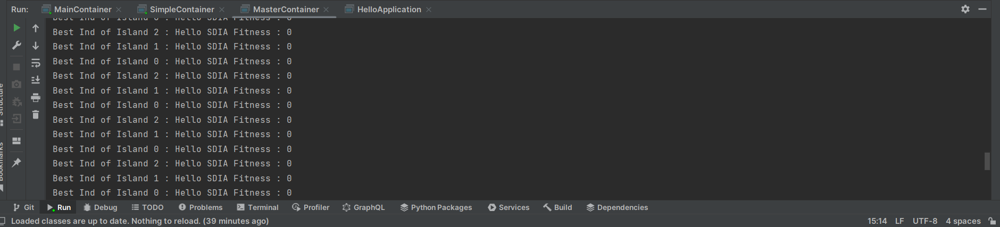

<h3> Genetic Algorithm implementation using Multi-Agent Systems Island </h3>
<h1>compte rendu</h1> 
<h2> GAIslandAgent </h2> 
 
<h2>GAUtils</h2> 
 
<h2>GeneticAlgorithm</h2> 
 
<h2>MainContainer</h2> 
 
<h2>MasterAgent</h2> 
 
<h2>MasterContainer</h2> 
 
<h2>Execution</h2> 
 
